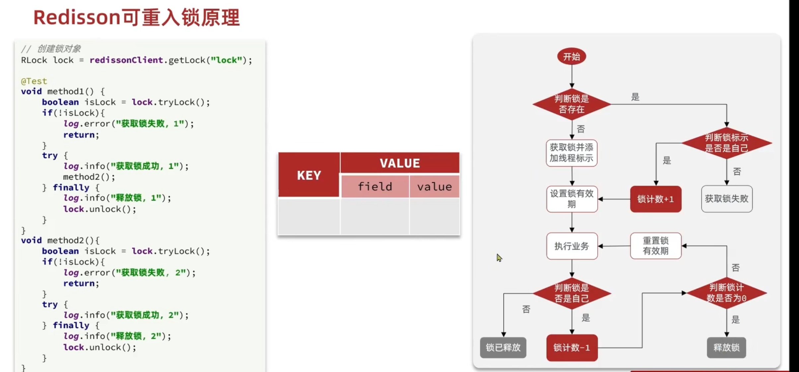
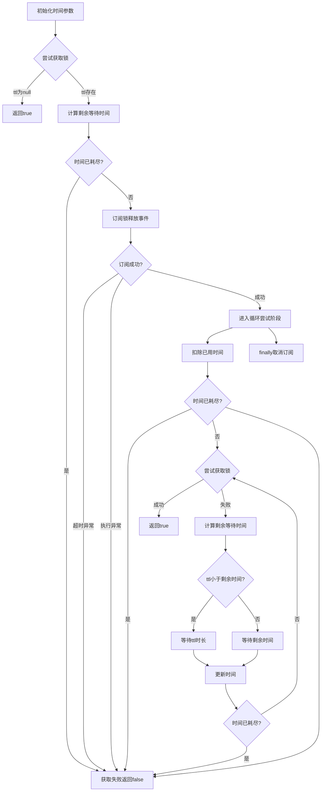

## 基于setnx实现的分布式锁存在下面的问题
1、不可重入：同一个线程无法多次获取同一把锁    
2、不可重试：获取锁只尝试一次就返回false，没有重试机制     
3、超时释放：锁超时释放虽然可以避免死锁，如果是业务执行耗时较长，也会导致锁释放，存在安全隐患   
4、主从一致性问题：如果Redis提供了主从集群主从同步存在延迟，当主宕机时，如果从并同步主中的所数据，则会出现锁实现   

## Redission
redission是一个再redis的基础上实现的java驻内存数据网格。   
它不仅提供了一系列的分布式的java常用对象，还提供了许多分布式服务，其中就包含了各种分布式锁的实现。   

### Redisson可重入的原理
   

### Redisson解决可重试、超时释放和主从一致性问题   
重试逻辑：    
1、尝试获取锁，成功返回true   
2、计算剩余等待时间，超时返回false  
3、订阅锁释放事件进入等待   
4、循环尝试获取锁，根据TTL动态调整等待时间，超时或成功时终止   

Redission分布式锁原理：   
1、可重入： 利用hash结构记录线程和重入次数    
2、可重试： 利用信号量和PubSub(发布订阅)功能实现等待、唤醒、获取锁失败的重试机制
3、超时续约： 利用watchDog机制，每个一段时间(releaseTime/3),重置时间