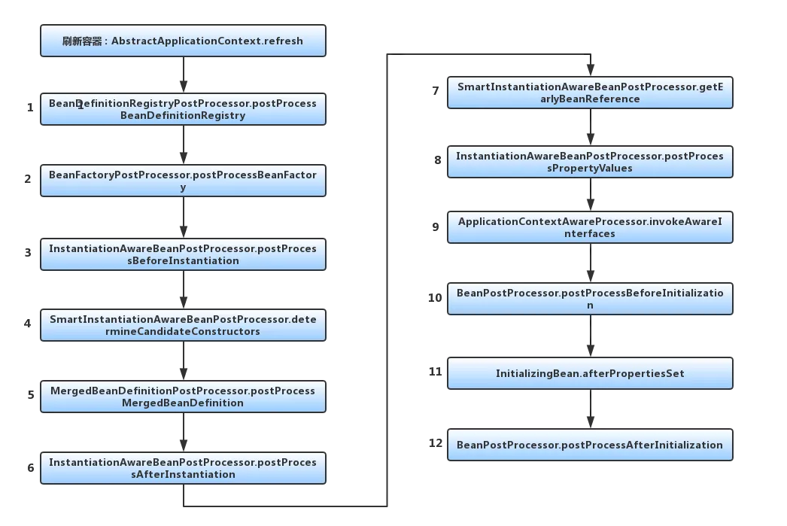

## SpringIOC
Spring 的核心思想即是容器。整个容器 refresh 时，外部看似风平浪静，内部实则一片汪洋大海。另外整个流程严格遵守开闭原则，内部对修改关闭，对扩展开放。
> 可以这么理解： 把 Spring 容器理解为一个钥匙环，上面挂满了钥匙，每个钥匙理解为一个扩展接口。钥匙的顺序是固定的，可理解为接口的调用顺序固定，对修改关闭。每个钥匙可以用来做不同的事情，可理解为扩展接口的不同实现，对扩展开放。

调用顺序如下：  



1. springboot在执行run方法时，最后会调用refreshContext(context);方法，而refreshContext(context)，实际最后底层调用的则是AbstractApplicationContext中的refresh()方法，  
源码如下
```java
public ConfigurableApplicationContext run(String... args) {
    StopWatch stopWatch = new StopWatch();
    stopWatch.start();
    DefaultBootstrapContext bootstrapContext = createBootstrapContext();
    ConfigurableApplicationContext context = null;
    configureHeadlessProperty();
    SpringApplicationRunListeners listeners = getRunListeners(args);
    listeners.starting(bootstrapContext, this.mainApplicationClass);
    try {
        ApplicationArguments applicationArguments = new DefaultApplicationArguments(args);
        ConfigurableEnvironment environment = prepareEnvironment(listeners, bootstrapContext, applicationArguments);
        configureIgnoreBeanInfo(environment);
        Banner printedBanner = printBanner(environment);
        // 创建ApplicationContext实际就是GenericApplicationContext
        context = createApplicationContext();
        context.setApplicationStartup(this.applicationStartup);
        prepareContext(bootstrapContext, context, environment, listeners, applicationArguments, printedBanner);
        // 调用refreshContext方法
        refreshContext(context);
        afterRefresh(context, applicationArguments);
        stopWatch.stop();
        if (this.logStartupInfo) {
            new StartupInfoLogger(this.mainApplicationClass).logStarted(getApplicationLog(), stopWatch);
        }
        listeners.started(context);
        callRunners(context, applicationArguments);
    }
    catch (Throwable ex) {
        handleRunFailure(context, ex, listeners);
        throw new IllegalStateException(ex);
    }

    try {
        listeners.running(context);
    }
    catch (Throwable ex) {
        handleRunFailure(context, ex, null);
        throw new IllegalStateException(ex);
    }
    return context;
}

// refreshContext(ConfigurableApplicationContext context)方法
private void refreshContext(ConfigurableApplicationContext context) {
    if (this.registerShutdownHook) {
        shutdownHook.registerApplicationContext(context);
    }
    refresh(context);
}

// refresh(ConfigurableApplicationContext applicationContext)方法
protected void refresh(ConfigurableApplicationContext applicationContext) {
    // 实际调用AbstractApplicationContext中的refresh()方法
    applicationContext.refresh();
}
```
2. AbstractApplicationContext中的refresh()方法，源码如下 
```java
@Override
public void refresh() throws BeansException, IllegalStateException {
    synchronized (this.startupShutdownMonitor) {
        StartupStep contextRefresh = this.applicationStartup.start("spring.context.refresh");
        
        // 刷新上下文环境
        prepareRefresh();

        // 这里是在子类中启动 refreshBeanFactory() 的地方
        ConfigurableListableBeanFactory beanFactory = obtainFreshBeanFactory();
        
        // 准备bean工厂，以便在此上下文中使用
        prepareBeanFactory(beanFactory);

        try {
            //设置 beanFactory 的后置处理
            postProcessBeanFactory(beanFactory);

            StartupStep beanPostProcess = this.applicationStartup.start("spring.context.beans.post-process");
            //调用 BeanFactory 的后处理器，这些处理器是在Bean 定义中向容器注册的
            invokeBeanFactoryPostProcessors(beanFactory);

            //注册Bean的后处理器，在Bean创建过程中调用
            registerBeanPostProcessors(beanFactory);
            beanPostProcess.end();

            //对上下文中的消息源进行初始化
            initMessageSource();

            //初始化上下文中的事件机制
            initApplicationEventMulticaster();

            //初始化其他特殊的Bean
            onRefresh();

            //检查监听Bean并且将这些监听Bean向容器注册
            registerListeners();

            //实例化所有的（non-lazy-init）单件
            finishBeanFactoryInitialization(beanFactory);

            //发布容器事件，结束Refresh过程
            finishRefresh();
        }

        catch (BeansException ex) {
            if (logger.isWarnEnabled()) {
                logger.warn("Exception encountered during context initialization - " +
                        "cancelling refresh attempt: " + ex);
            }

            // Destroy already created singletons to avoid dangling resources.
            destroyBeans();

            // Reset 'active' flag.
            cancelRefresh(ex);

            // Propagate exception to caller.
            throw ex;
        }

        finally {
            // Reset common introspection caches in Spring's core, since we
            // might not ever need metadata for singleton beans anymore...
            resetCommonCaches();
            contextRefresh.end();
        }
    }
}
```
3. obtainFreshBeanFactory();  
在启动流程的第三步：返回了一个BeanFactory，实际上就是 GenericApplicationContext ，它属于BeanFactory的子类 AbstractApplicationContext 的子类
```java
// AbstractApplicationContext中的源码
 protected ConfigurableListableBeanFactory obtainFreshBeanFactory() {
    refreshBeanFactory();
    return getBeanFactory();
}

// 最后实际调用的是 GenericApplicationContext 中的getBeanFactory()方法
public final ConfigurableListableBeanFactory getBeanFactory() {
    return this.beanFactory;
}
```
那GenericApplicationContext实际上是在什么时候创建的呢？
> 在run()方法中调用context = createApplicationContext();的时候通过构造函数创建的
```java
public ConfigurableApplicationContext run(String... args) {
    StopWatch stopWatch = new StopWatch();
    stopWatch.start();
    DefaultBootstrapContext bootstrapContext = createBootstrapContext();
    ConfigurableApplicationContext context = null;
    configureHeadlessProperty();
    SpringApplicationRunListeners listeners = getRunListeners(args);
    listeners.starting(bootstrapContext, this.mainApplicationClass);
    try {
        ApplicationArguments applicationArguments = new DefaultApplicationArguments(args);
        ConfigurableEnvironment environment = prepareEnvironment(listeners, bootstrapContext, applicationArguments);
        configureIgnoreBeanInfo(environment);
        Banner printedBanner = printBanner(environment);
        // 创建容器
        context = createApplicationContext();
        
        context.setApplicationStartup(this.applicationStartup);
        prepareContext(bootstrapContext, context, environment, listeners, applicationArguments, printedBanner);
        refreshContext(context);
        afterRefresh(context, applicationArguments);
        stopWatch.stop();
        if (this.logStartupInfo) {
            new StartupInfoLogger(this.mainApplicationClass).logStarted(getApplicationLog(), stopWatch);
        }
        listeners.started(context);
        callRunners(context, applicationArguments);
    }
    catch (Throwable ex) {
        handleRunFailure(context, ex, listeners);
        throw new IllegalStateException(ex);
    }

    try {
        listeners.running(context);
    }
    catch (Throwable ex) {
        handleRunFailure(context, ex, null);
        throw new IllegalStateException(ex);
    }
    return context;
}

// 创建容器方法
protected ConfigurableApplicationContext createApplicationContext() {
    return this.applicationContextFactory.create(this.webApplicationType);
}
```
4. 通过第三步获取到context后，执行prepareContext(bootstrapContext, context, environment, listeners, applicationArguments, printedBanner);做准备条件
```java  
protected void prepareBeanFactory(ConfigurableListableBeanFactory beanFactory) {
    // 配置类加载器，默认使用当前上下文的类加载器
    beanFactory.setBeanClassLoader(getClassLoader());
    // 判断是否需要配置EL表达式：在Bean初始化完成，填充属性的时候会用到
    if (!shouldIgnoreSpel) {
        beanFactory.setBeanExpressionResolver(new StandardBeanExpressionResolver(beanFactory.getBeanClassLoader()));
    }
    // 添加属性编辑器 PropertyEditor
    beanFactory.addPropertyEditorRegistrar(new ResourceEditorRegistrar(this, getEnvironment()));

    // 添加Bean的后置处理器
    beanFactory.addBeanPostProcessor(new ApplicationContextAwareProcessor(this));
    // 忽略装配以下指定的类
    beanFactory.ignoreDependencyInterface(EnvironmentAware.class);
    beanFactory.ignoreDependencyInterface(EmbeddedValueResolverAware.class);
    beanFactory.ignoreDependencyInterface(ResourceLoaderAware.class);
    beanFactory.ignoreDependencyInterface(ApplicationEventPublisherAware.class);
    beanFactory.ignoreDependencyInterface(MessageSourceAware.class);
    beanFactory.ignoreDependencyInterface(ApplicationContextAware.class);
    beanFactory.ignoreDependencyInterface(ApplicationStartupAware.class);

    // 将以下类注册到 beanFactory（DefaultListableBeanFactory） 的resolvableDependencies属性中
    beanFactory.registerResolvableDependency(BeanFactory.class, beanFactory);
    beanFactory.registerResolvableDependency(ResourceLoader.class, this);
    beanFactory.registerResolvableDependency(ApplicationEventPublisher.class, this);
    beanFactory.registerResolvableDependency(ApplicationContext.class, this);

    // 将早期后处理器注册为application监听器，用于检测内部bean
    beanFactory.addBeanPostProcessor(new ApplicationListenerDetector(this));

    //如果当前BeanFactory包含loadTimeWeaver Bean，说明存在类加载期织入AspectJ，
    // 则把当前BeanFactory交给类加载期BeanPostProcessor实现类LoadTimeWeaverAwareProcessor来处理，
    // 从而实现类加载期织入AspectJ的目的。
    if (!NativeDetector.inNativeImage() && beanFactory.containsBean(LOAD_TIME_WEAVER_BEAN_NAME)) {
        beanFactory.addBeanPostProcessor(new LoadTimeWeaverAwareProcessor(beanFactory));
        // Set a temporary ClassLoader for type matching.
        beanFactory.setTempClassLoader(new ContextTypeMatchClassLoader(beanFactory.getBeanClassLoader()));
    }

    // Register default environment beans.
    if (!beanFactory.containsLocalBean(ENVIRONMENT_BEAN_NAME)) {
        beanFactory.registerSingleton(ENVIRONMENT_BEAN_NAME, getEnvironment());
    }
    if (!beanFactory.containsLocalBean(SYSTEM_PROPERTIES_BEAN_NAME)) {
        beanFactory.registerSingleton(SYSTEM_PROPERTIES_BEAN_NAME, getEnvironment().getSystemProperties());
    }
    if (!beanFactory.containsLocalBean(SYSTEM_ENVIRONMENT_BEAN_NAME)) {
        beanFactory.registerSingleton(SYSTEM_ENVIRONMENT_BEAN_NAME, getEnvironment().getSystemEnvironment());
    }
    if (!beanFactory.containsLocalBean(APPLICATION_STARTUP_BEAN_NAME)) {
        beanFactory.registerSingleton(APPLICATION_STARTUP_BEAN_NAME, getApplicationStartup());
    }
} 
```
5. postProcessBeanFactory(beanFactory);
> postProcessBeanFactory()方法向上下文中添加了一系列的Bean的后置处理器。后置处理器工作的时机是在所有的beanDenifition加载完成之后，bean实例化之前执行。简单来说Bean的后置处理器可以修改BeanDefinition的属性信息  
6. invokeBeanFactoryPostProcessors(beanFactory);（重点）
> 前面的方法只是实现了IOC容器的创建，但并没实现IOC容器的实例化，而这个方法就是实现IOC容器初始化过程