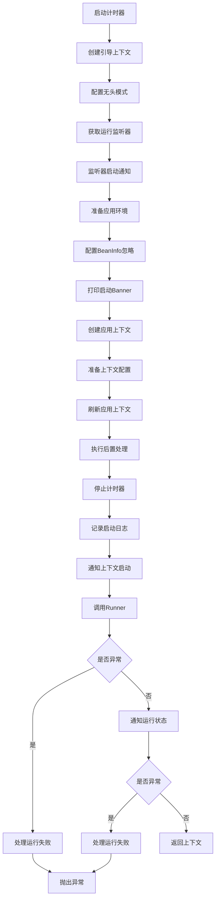
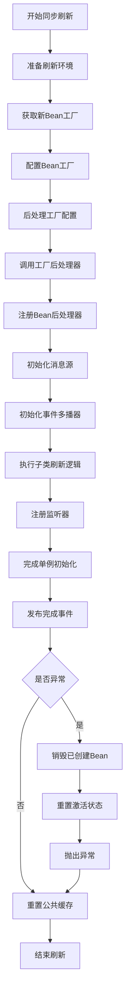
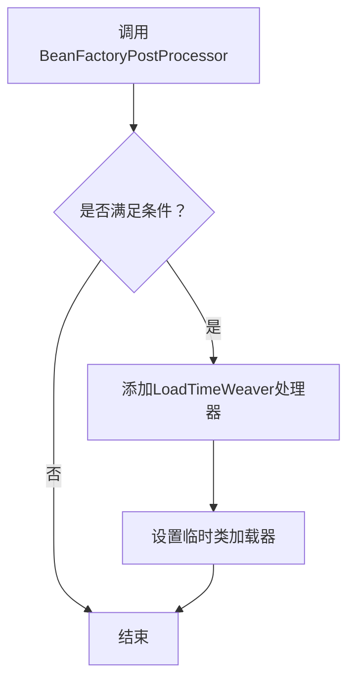
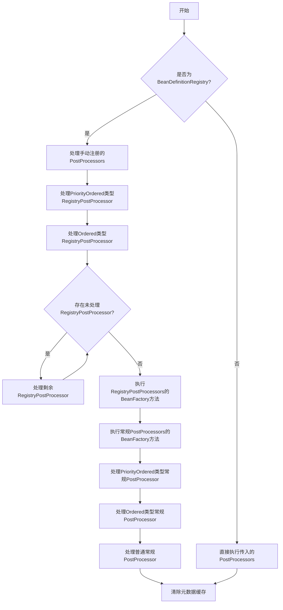
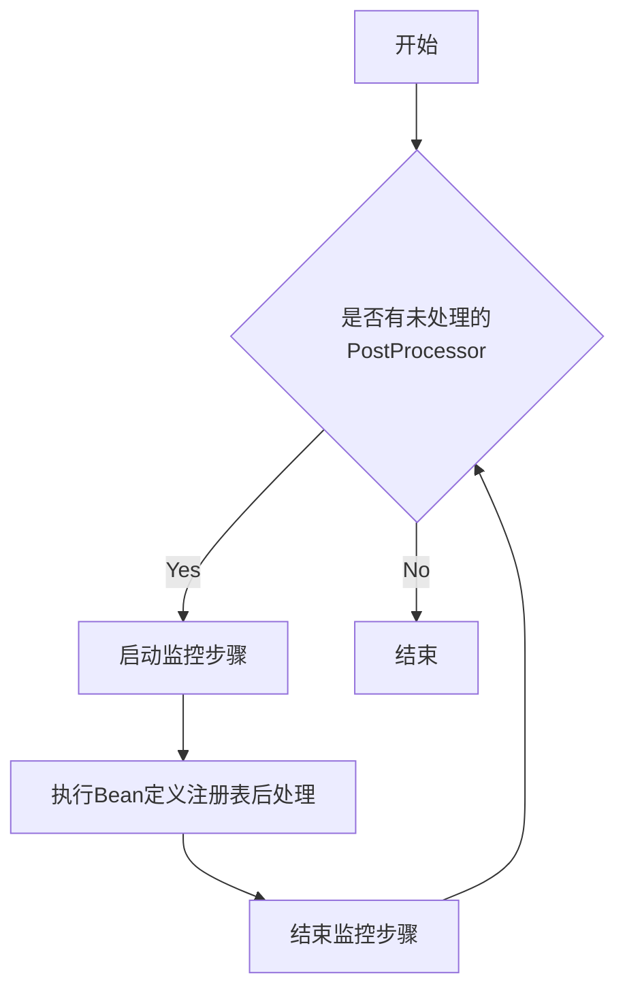

## Spring Boot 自动装配原理，源码剖析

1. springboot项目启动时，执行SpringApplication.run()方法

```java

@SpringBootApplication
public class HmDianPingApplication {
    public static void main(String[] args) {
        SpringApplication.run(HmDianPingApplication.class, args);
    }
}
```

2. 在SpringApplication类的run()的方法中，最终会重载调用public ConfigurableApplicationContext run(String... args)
   方法，这个方法内会调用一个refreshContext(context)方法来完成自动装配操作



```java
public ConfigurableApplicationContext run(String... args) {
    // 启动计时器,用于记录应用启动耗时
    StopWatch stopWatch = new StopWatch();
    stopWatch.start();
    // 创建引导上下文和运行监听器
    DefaultBootstrapContext bootstrapContext = createBootstrapContext();
    ConfigurableApplicationContext context = null;
    configureHeadlessProperty();
    SpringApplicationRunListeners listeners = getRunListeners(args);
    listeners.starting(bootstrapContext, this.mainApplicationClass);
    try {
        // 阶段1：准备应用环境
        ApplicationArguments applicationArguments = new DefaultApplicationArguments(args);
        ConfigurableEnvironment environment = prepareEnvironment(listeners, bootstrapContext, applicationArguments);
        configureIgnoreBeanInfo(environment);
        Banner printedBanner = printBanner(environment);
        // 阶段2：创建并配置应用上下文
        context = createApplicationContext();
        context.setApplicationStartup(this.applicationStartup);
        prepareContext(bootstrapContext, context, environment, listeners, applicationArguments, printedBanner);
        // 阶段3：刷新应用上下文(核心容器初始化)
        refreshContext(context);
        afterRefresh(context, applicationArguments);
        stopWatch.stop();
        if (this.logStartupInfo) {
            new StartupInfoLogger(this.mainApplicationClass).logStarted(getApplicationLog(), stopWatch);
        }
        listeners.started(context);
        callRunners(context, applicationArguments);
    } catch (Throwable ex) {
        handleRunFailure(context, ex, listeners);
        throw new IllegalStateException(ex);
    }

    try {
        // 最终阶段：通知应用处于运行中状态
        listeners.running(context);
    } catch (Throwable ex) {
        handleRunFailure(context, ex, null);
        throw new IllegalStateException(ex);
    }
    return context;
}
```

3. run()方法中主要的核心是refreshContext(context)
   ;方法的调用，核心容器初始化，这个过程实际上就是springboot自动装配的核心过程，最终默认调用的是AbstractApplicationContext中的refresh()
   方法.

> 这段代码是Spring框架中AbstractApplicationContext类的refresh方法，负责容器的刷新过程。根据代码结构，可以看出这是一个典型的IoC容器初始化的流程。



```java
/**
 * springboot应用上下文的核心刷新方法，负责初始化，配置和销毁Bean的全声明周期管理
 */
public void refresh() throws BeansException, IllegalStateException {
    // 同步代码块保证刷新操作的线程安全，使用startupShutdownMonitor对象锁
    synchronized (this.startupShutdownMonitor) {
        // 启动性能监控步骤：上下文刷新阶段跟踪
        StartupStep contextRefresh = this.applicationStartup.start("spring.context.refresh");

        /**
         * 准备阶段
         * 1、设置上下文启动时间
         * 2、初始化占位符属性源
         * 3、验证必要环境属性
         */
        prepareRefresh();

        /**
         * bean工厂创建阶段：
         * 获取/创建新的BeanFactory实例，解析并加载Bean定义
         */
        ConfigurableListableBeanFactory beanFactory = obtainFreshBeanFactory();

        /**
         * 标准Bean工程配置
         * 1、配置类加载器
         * 2、添加SPEL表达式解析器
         * 3、注册环境相关的Bean
         */
        prepareBeanFactory(beanFactory);

        try {
            /**
             * 后置处理
             * 允许子类对BeanFactory进行自定义后处理
             */
            postProcessBeanFactory(beanFactory);

            /**
             * 启动性能监控步骤：BeanFactory后处理器阶段跟踪
             */
            StartupStep beanPostProcess = this.applicationStartup.start("spring.context.beans.post-process");

            /**
             * Bean定义处理阶段
             * 1、执行BeanFactory后处理器
             * 2、注册Bean后处理器
             */
            invokeBeanFactoryPostProcessors(beanFactory);

            registerBeanPostProcessors(beanFactory);
            beanPostProcess.end();

            /**
             * 国际化支持
             * 1、初始化消息源组件
             */
            initMessageSource();

            /**
             * 事件机制初始化
             * 1、初始化事件多播器
             */
            initApplicationEventMulticaster();

            /** 模板方法扩展点：
             * 允许子类初始化特殊Bean（如Web容器相关Bean） 
             */
            onRefresh();

            /**
             * 事件监听器注册：
             * 1. 添加静态指定的监听器
             * . 注册早期应用事件
             */
            registerListeners();

            /**
             * Bean初始化阶段：
             * 1. 初始化所有非延迟加载的单例Bean
             * 2. 发布ContextRefreshedEvent事件 
             */
            finishBeanFactoryInitialization(beanFactory);

            /* 完成阶段：
             * 1. 初始化生命周期处理器
             * 2. 发布最终事件 */
            finishRefresh();
        } catch (BeansException ex) {
            /* 异常处理流程：
             * 1. 记录警告日志
             * 2. 销毁已创建的Bean
             * 3. 重置上下文激活状态 */
            if (logger.isWarnEnabled()) {
                logger.warn("Exception encountered during context initialization - " +
                        "cancelling refresh attempt: " + ex);
            }

            destroyBeans();

            cancelRefresh(ex);

            throw ex;
        } finally {
            resetCommonCaches();
            contextRefresh.end();
        }
    }
}
```

4. 上面的refresh()方法中，调用了invokeBeanFactoryPostProcessors()

> 该函数功能  
> 1、调用所用注册的BeanFactoryPostProcessor处理Bean工厂  
> 2、检测是否存在LoadTimeWeaver，若满足条件则添加对应处理器和临时类加载器。  
> 主要处理Bean工厂的后期加工和类加载时织入准备。



```java
/**
 * 调用所有注册的BeanFactoryPostProcessor后置处理器
 * 该方法负责两个核心功能：
 * 1. 触发BeanFactoryPostProcessor对Bean定义的扩展处理（如配置类解析、属性占位符替换等）
 * 2. 在非原生镜像环境下初始化加载时织入(LTW)支持
 * @param beanFactory 可配置的Bean工厂实例，用于：
 *                    - 获取当前Bean定义
 *                    - 注册Bean后置处理器
 *                    - 管理类加载器
 */
protected void invokeBeanFactoryPostProcessors(ConfigurableListableBeanFactory beanFactory) {
    // 核心处理逻辑：委托给PostProcessorRegistrationDelegate处理
    PostProcessorRegistrationDelegate.invokeBeanFactoryPostProcessors(beanFactory, getBeanFactoryPostProcessors());
    		/* 加载时织入(LTW)支持的条件判断：
		- 不在GraalVM原生镜像中运行
		- 尚未设置临时类加载器 
		- 存在loadTimeWeaver bean定义 */
    if (!NativeDetector.inNativeImage() && beanFactory.getTempClassLoader() == null && beanFactory.containsBean(LOAD_TIME_WEAVER_BEAN_NAME)) {
        // 注册LoadTimeWeaverAwareProcessor以支持@EnableLoadTimeWeaving
        beanFactory.addBeanPostProcessor(new LoadTimeWeaverAwareProcessor(beanFactory));
        // 设置类型匹配专用的临时类加载器
        beanFactory.setTempClassLoader(new ContextTypeMatchClassLoader(beanFactory.getBeanClassLoader()));
    }
}
```

5. 上面的invokeBeanFactoryPostProcessors()
   方法中，调用了PostProcessorRegistrationDelegate.invokeBeanFactoryPostProcessors()

> 该方法是Spring框架中用于触发BeanFactoryPostProcessor的核心逻辑，分阶段处理Bean定义注册和Bean工厂修改     
> 1.优先处理BeanDefinitionRegistryPostProcessor（分PriorityOrdered、Ordered、普通三个顺序）    
> 2.处理常规BeanFactoryPostProcessor（分优先级顺序执行）  
> 3.最后清除元数据缓存



```java
/**
 * 调用所有已注册的BeanFactoryPostProcessor对BeanFactory进行后处理
 *
 * @param beanFactory 可配置的Bean工厂，用于获取Bean定义及处理元数据
 * @param beanFactoryPostProcessors 手动注册的BeanFactoryPostProcessor列表（非通过Bean定义注册的）
 */
public static void invokeBeanFactoryPostProcessors(
        ConfigurableListableBeanFactory beanFactory, List<BeanFactoryPostProcessor> beanFactoryPostProcessors) {
    // 用于记录已处理的Bean名称，防止重复处理
    Set<String> processedBeans = new HashSet<>();

    // 处理BeanDefinitionRegistry的特殊逻辑
    if (beanFactory instanceof BeanDefinitionRegistry) {
        BeanDefinitionRegistry registry = (BeanDefinitionRegistry) beanFactory;

        // 分离常规处理器和注册表处理器
        List<BeanFactoryPostProcessor> regularPostProcessors = new ArrayList<>();
        List<BeanDefinitionRegistryPostProcessor> registryProcessors = new ArrayList<>();

        // 处理显示注册器的BeanFactory后处理器
        for (BeanFactoryPostProcessor postProcessor : beanFactoryPostProcessors) {
            if (postProcessor instanceof BeanDefinitionRegistryPostProcessor) {
                // 执行Bean定义注册表级别的后处理
                BeanDefinitionRegistryPostProcessor registryProcessor =
                        (BeanDefinitionRegistryPostProcessor) postProcessor;
                registryProcessor.postProcessBeanDefinitionRegistry(registry);
                registryProcessors.add(registryProcessor);
            } else {
                regularPostProcessors.add(postProcessor);
            }
        }

        // 按优先级分阶段处理BeanDefinitionRegistryPostProcessor
        List<BeanDefinitionRegistryPostProcessor> currentRegistryProcessors = new ArrayList<>();

        // 第一阶段：处理实现PriorityOrdered接口的处理器
        String[] postProcessorNames =
                beanFactory.getBeanNamesForType(BeanDefinitionRegistryPostProcessor.class, true, false);
        for (String ppName : postProcessorNames) {
            if (beanFactory.isTypeMatch(ppName, PriorityOrdered.class)) {
                currentRegistryProcessors.add(beanFactory.getBean(ppName, BeanDefinitionRegistryPostProcessor.class));
                processedBeans.add(ppName);
            }
        }
        sortPostProcessors(currentRegistryProcessors, beanFactory);
        registryProcessors.addAll(currentRegistryProcessors);

        /**
         * 执行BeanDefinitionRegistryPostProcessor的后处理方法
         *
         * @param currentRegistryProcessors 当前需要处理的注册表处理器集合
         * @param registry Bean定义注册中心接口，用于接收后处理器的修改
         * @param applicationStartup 应用启动追踪器，用于记录后处理器执行阶段的性能指标
         */
        invokeBeanDefinitionRegistryPostProcessors(currentRegistryProcessors, registry, beanFactory.getApplicationStartup());
        currentRegistryProcessors.clear();

        // 第二阶段：处理实现Ordered接口的处理器
        postProcessorNames = beanFactory.getBeanNamesForType(BeanDefinitionRegistryPostProcessor.class, true, false);
        for (String ppName : postProcessorNames) {
            if (!processedBeans.contains(ppName) && beanFactory.isTypeMatch(ppName, Ordered.class)) {
                currentRegistryProcessors.add(beanFactory.getBean(ppName, BeanDefinitionRegistryPostProcessor.class));
                processedBeans.add(ppName);
            }
        }
        sortPostProcessors(currentRegistryProcessors, beanFactory);
        registryProcessors.addAll(currentRegistryProcessors);
        invokeBeanDefinitionRegistryPostProcessors(currentRegistryProcessors, registry, beanFactory.getApplicationStartup());
        currentRegistryProcessors.clear();

        // 第三阶段：处理剩余未排序的处理器（可能产生新的处理器）
        boolean reiterate = true;
        while (reiterate) {
            reiterate = false;
            postProcessorNames = beanFactory.getBeanNamesForType(BeanDefinitionRegistryPostProcessor.class, true, false);
            for (String ppName : postProcessorNames) {
                if (!processedBeans.contains(ppName)) {
                    currentRegistryProcessors.add(beanFactory.getBean(ppName, BeanDefinitionRegistryPostProcessor.class));
                    processedBeans.add(ppName);
                    reiterate = true; // 发现新处理器需要重新迭代
                }
            }
            sortPostProcessors(currentRegistryProcessors, beanFactory);
            registryProcessors.addAll(currentRegistryProcessors);
            invokeBeanDefinitionRegistryPostProcessors(currentRegistryProcessors, registry, beanFactory.getApplicationStartup());
            currentRegistryProcessors.clear();
        }

        // 最后执行所有的BeanDefinitionRegistryPostProcessor的postProcessBeanFactory方法
        invokeBeanFactoryPostProcessors(registryProcessors, beanFactory);
        invokeBeanFactoryPostProcessors(regularPostProcessors, beanFactory);
    } else {
        // 非BeanDefinitionRegistry环境的简单处理
        invokeBeanFactoryPostProcessors(beanFactoryPostProcessors, beanFactory);
    }

    // 处理普通常规BeanFactoryPostProcessor
    String[] postProcessorNames =
            beanFactory.getBeanNamesForType(BeanFactoryPostProcessor.class, true, false);

    // 按优先级分类处理器
    List<BeanFactoryPostProcessor> priorityOrderedPostProcessors = new ArrayList<>();
    List<String> orderedPostProcessorNames = new ArrayList<>();
    List<String> nonOrderedPostProcessorNames = new ArrayList<>();
    for (String ppName : postProcessorNames) {
        if (processedBeans.contains(ppName)) {
            // 跳过已处理的处理器
        } else if (beanFactory.isTypeMatch(ppName, PriorityOrdered.class)) {
            priorityOrderedPostProcessors.add(beanFactory.getBean(ppName, BeanFactoryPostProcessor.class));
        } else if (beanFactory.isTypeMatch(ppName, Ordered.class)) {
            orderedPostProcessorNames.add(ppName);
        } else {
            nonOrderedPostProcessorNames.add(ppName);
        }
    }

    // 按优先级顺序执行处理器
    sortPostProcessors(priorityOrderedPostProcessors, beanFactory);
    invokeBeanFactoryPostProcessors(priorityOrderedPostProcessors, beanFactory);

    List<BeanFactoryPostProcessor> orderedPostProcessors = new ArrayList<>(orderedPostProcessorNames.size());
    for (String postProcessorName : orderedPostProcessorNames) {
        orderedPostProcessors.add(beanFactory.getBean(postProcessorName, BeanFactoryPostProcessor.class));
    }

    // 处理有序的常规处理器
    sortPostProcessors(orderedPostProcessors, beanFactory);
    invokeBeanFactoryPostProcessors(orderedPostProcessors, beanFactory);

    // 最后处理无序的常规处理器
    List<BeanFactoryPostProcessor> nonOrderedPostProcessors = new ArrayList<>(nonOrderedPostProcessorNames.size());
    for (String postProcessorName : nonOrderedPostProcessorNames) {
        nonOrderedPostProcessors.add(beanFactory.getBean(postProcessorName, BeanFactoryPostProcessor.class));
    }
    invokeBeanFactoryPostProcessors(nonOrderedPostProcessors, beanFactory);

    // 清楚元数据缓存
    beanFactory.clearMetadataCache();
}
```

6. 调用PostProcessorRegistrationDelegate中的invokeBeanDefinitionRegistryPostProcessors(Collection<? extends BeanDefinitionRegistryPostProcessor> postProcessors, BeanDefinitionRegistry registry, ApplicationStartup applicationStartup)
> 
> 遍历所有BeanDefinitionRegistryPostProcessor实现类，依次执行其postProcessBeanDefinitionRegistry方法，并通过ApplicationStartup记录每个处理器的执行耗时。 
> 

```java
/**
 * 调用所有已注册的BeanDefinitionRegistryPostProcessor的后处理方法
 *
 * @param postProcessors 需要被处理的BeanDefinitionRegistryPostProcessor集合，这些处理器将按顺序执行注册表的后处理逻辑
 * @param registry Bean定义注册中心，用于持有和管理BeanDefinition的核心接口，后处理器将对此注册表进行操作
 * @param applicationStartup 应用启动指标收集器，用于跟踪后处理器的执行性能指标
 */
private static void invokeBeanDefinitionRegistryPostProcessors(
        Collection<? extends BeanDefinitionRegistryPostProcessor> postProcessors, BeanDefinitionRegistry registry, ApplicationStartup applicationStartup) {

   // 遍历所有后处理器并执行注册表级别的后处理
    for (BeanDefinitionRegistryPostProcessor postProcessor : postProcessors) {
       // 创建并记录后处理器执行指标
        StartupStep postProcessBeanDefRegistry = applicationStartup.start("spring.context.beandef-registry.post-process")
                .tag("postProcessor", postProcessor::toString);
       // 执行当前后处理器对Bean定义注册表的处理逻辑
        postProcessor.postProcessBeanDefinitionRegistry(registry);
       // 结束当前处理器的指标记录
        postProcessBeanDefRegistry.end();
    }
}
```
7. 调用ConfigurationClassPostProcessor中的postProcessBeanDefinitionRegistry(BeanDefinitionRegistry registry)
```java
	public void postProcessBeanDefinitionRegistry(BeanDefinitionRegistry registry) {
   int registryId = System.identityHashCode(registry);
   if (this.registriesPostProcessed.contains(registryId)) {
      throw new IllegalStateException(
              "postProcessBeanDefinitionRegistry already called on this post-processor against " + registry);
   }
   if (this.factoriesPostProcessed.contains(registryId)) {
      throw new IllegalStateException(
              "postProcessBeanFactory already called on this post-processor against " + registry);
   }
   this.registriesPostProcessed.add(registryId);

   processConfigBeanDefinitions(registry);
}
```

8. diayog
```java
public void processConfigBeanDefinitions(BeanDefinitionRegistry registry) {
   List<BeanDefinitionHolder> configCandidates = new ArrayList<>();
   String[] candidateNames = registry.getBeanDefinitionNames();

   for (String beanName : candidateNames) {
      BeanDefinition beanDef = registry.getBeanDefinition(beanName);
      if (beanDef.getAttribute(ConfigurationClassUtils.CONFIGURATION_CLASS_ATTRIBUTE) != null) {
         if (logger.isDebugEnabled()) {
            logger.debug("Bean definition has already been processed as a configuration class: " + beanDef);
         }
      }
      else if (ConfigurationClassUtils.checkConfigurationClassCandidate(beanDef, this.metadataReaderFactory)) {
         configCandidates.add(new BeanDefinitionHolder(beanDef, beanName));
      }
   }

   // Return immediately if no @Configuration classes were found
   if (configCandidates.isEmpty()) {
      return;
   }

   // Sort by previously determined @Order value, if applicable
   configCandidates.sort((bd1, bd2) -> {
      int i1 = ConfigurationClassUtils.getOrder(bd1.getBeanDefinition());
      int i2 = ConfigurationClassUtils.getOrder(bd2.getBeanDefinition());
      return Integer.compare(i1, i2);
   });

   // Detect any custom bean name generation strategy supplied through the enclosing application context
   SingletonBeanRegistry sbr = null;
   if (registry instanceof SingletonBeanRegistry) {
      sbr = (SingletonBeanRegistry) registry;
      if (!this.localBeanNameGeneratorSet) {
         BeanNameGenerator generator = (BeanNameGenerator) sbr.getSingleton(
                 AnnotationConfigUtils.CONFIGURATION_BEAN_NAME_GENERATOR);
         if (generator != null) {
            this.componentScanBeanNameGenerator = generator;
            this.importBeanNameGenerator = generator;
         }
      }
   }

   if (this.environment == null) {
      this.environment = new StandardEnvironment();
   }

   // Parse each @Configuration class
   ConfigurationClassParser parser = new ConfigurationClassParser(
           this.metadataReaderFactory, this.problemReporter, this.environment,
           this.resourceLoader, this.componentScanBeanNameGenerator, registry);

   Set<BeanDefinitionHolder> candidates = new LinkedHashSet<>(configCandidates);
   Set<ConfigurationClass> alreadyParsed = new HashSet<>(configCandidates.size());
   do {
      StartupStep processConfig = this.applicationStartup.start("spring.context.config-classes.parse");
      parser.parse(candidates);
      parser.validate();

      Set<ConfigurationClass> configClasses = new LinkedHashSet<>(parser.getConfigurationClasses());
      configClasses.removeAll(alreadyParsed);

      // Read the model and create bean definitions based on its content
      if (this.reader == null) {
         this.reader = new ConfigurationClassBeanDefinitionReader(
                 registry, this.sourceExtractor, this.resourceLoader, this.environment,
                 this.importBeanNameGenerator, parser.getImportRegistry());
      }
      this.reader.loadBeanDefinitions(configClasses);
      alreadyParsed.addAll(configClasses);
      processConfig.tag("classCount", () -> String.valueOf(configClasses.size())).end();

      candidates.clear();
      if (registry.getBeanDefinitionCount() > candidateNames.length) {
         String[] newCandidateNames = registry.getBeanDefinitionNames();
         Set<String> oldCandidateNames = new HashSet<>(Arrays.asList(candidateNames));
         Set<String> alreadyParsedClasses = new HashSet<>();
         for (ConfigurationClass configurationClass : alreadyParsed) {
            alreadyParsedClasses.add(configurationClass.getMetadata().getClassName());
         }
         for (String candidateName : newCandidateNames) {
            if (!oldCandidateNames.contains(candidateName)) {
               BeanDefinition bd = registry.getBeanDefinition(candidateName);
               if (ConfigurationClassUtils.checkConfigurationClassCandidate(bd, this.metadataReaderFactory) &&
                       !alreadyParsedClasses.contains(bd.getBeanClassName())) {
                  candidates.add(new BeanDefinitionHolder(bd, candidateName));
               }
            }
         }
         candidateNames = newCandidateNames;
      }
   }
   while (!candidates.isEmpty());

   // Register the ImportRegistry as a bean in order to support ImportAware @Configuration classes
   if (sbr != null && !sbr.containsSingleton(IMPORT_REGISTRY_BEAN_NAME)) {
      sbr.registerSingleton(IMPORT_REGISTRY_BEAN_NAME, parser.getImportRegistry());
   }

   if (this.metadataReaderFactory instanceof CachingMetadataReaderFactory) {
      // Clear cache in externally provided MetadataReaderFactory; this is a no-op
      // for a shared cache since it'll be cleared by the ApplicationContext.
      ((CachingMetadataReaderFactory) this.metadataReaderFactory).clearCache();
   }
}
```
9. 调用ConfigurationClassParser中的
```java
public void parse(Set<BeanDefinitionHolder> configCandidates) {
   for (BeanDefinitionHolder holder : configCandidates) {
      BeanDefinition bd = holder.getBeanDefinition();
      try {
         if (bd instanceof AnnotatedBeanDefinition) {
            parse(((AnnotatedBeanDefinition) bd).getMetadata(), holder.getBeanName());
         }
         else if (bd instanceof AbstractBeanDefinition && ((AbstractBeanDefinition) bd).hasBeanClass()) {
            parse(((AbstractBeanDefinition) bd).getBeanClass(), holder.getBeanName());
         }
         else {
            parse(bd.getBeanClassName(), holder.getBeanName());
         }
      }
      catch (BeanDefinitionStoreException ex) {
         throw ex;
      }
      catch (Throwable ex) {
         throw new BeanDefinitionStoreException(
                 "Failed to parse configuration class [" + bd.getBeanClassName() + "]", ex);
      }
   }

   this.deferredImportSelectorHandler.process();
}
```
10.调用
```java
	protected final void parse(AnnotationMetadata metadata, String beanName) throws IOException {
		processConfigurationClass(new ConfigurationClass(metadata, beanName), DEFAULT_EXCLUSION_FILTER);
	}
```
11. 调用  
```java
protected void processConfigurationClass(ConfigurationClass configClass, Predicate<String> filter) throws IOException {
   if (this.conditionEvaluator.shouldSkip(configClass.getMetadata(), ConfigurationPhase.PARSE_CONFIGURATION)) {
      return;
   }

   ConfigurationClass existingClass = this.configurationClasses.get(configClass);
   if (existingClass != null) {
      if (configClass.isImported()) {
         if (existingClass.isImported()) {
            existingClass.mergeImportedBy(configClass);
         }
         // Otherwise ignore new imported config class; existing non-imported class overrides it.
         return;
      }
      else {
         // Explicit bean definition found, probably replacing an import.
         // Let's remove the old one and go with the new one.
         this.configurationClasses.remove(configClass);
         this.knownSuperclasses.values().removeIf(configClass::equals);
      }
   }

   // Recursively process the configuration class and its superclass hierarchy.
   SourceClass sourceClass = asSourceClass(configClass, filter);
   do {
      sourceClass = doProcessConfigurationClass(configClass, sourceClass, filter);
   }
   while (sourceClass != null);

   this.configurationClasses.put(configClass, configClass);
} 
```
12. 调用
```java
	@Nullable
protected final SourceClass doProcessConfigurationClass(
        ConfigurationClass configClass, SourceClass sourceClass, Predicate<String> filter)
        throws IOException {

   if (configClass.getMetadata().isAnnotated(Component.class.getName())) {
      // Recursively process any member (nested) classes first
      processMemberClasses(configClass, sourceClass, filter);
   }

   // Process any @PropertySource annotations
   for (AnnotationAttributes propertySource : AnnotationConfigUtils.attributesForRepeatable(
           sourceClass.getMetadata(), PropertySources.class,
           org.springframework.context.annotation.PropertySource.class)) {
      if (this.environment instanceof ConfigurableEnvironment) {
         processPropertySource(propertySource);
      }
      else {
         logger.info("Ignoring @PropertySource annotation on [" + sourceClass.getMetadata().getClassName() +
                 "]. Reason: Environment must implement ConfigurableEnvironment");
      }
   }

   // Process any @ComponentScan annotations
   Set<AnnotationAttributes> componentScans = AnnotationConfigUtils.attributesForRepeatable(
           sourceClass.getMetadata(), ComponentScans.class, ComponentScan.class);
   if (!componentScans.isEmpty() &&
           !this.conditionEvaluator.shouldSkip(sourceClass.getMetadata(), ConfigurationPhase.REGISTER_BEAN)) {
      for (AnnotationAttributes componentScan : componentScans) {
         // The config class is annotated with @ComponentScan -> perform the scan immediately
         Set<BeanDefinitionHolder> scannedBeanDefinitions =
                 this.componentScanParser.parse(componentScan, sourceClass.getMetadata().getClassName());
         // Check the set of scanned definitions for any further config classes and parse recursively if needed
         for (BeanDefinitionHolder holder : scannedBeanDefinitions) {
            BeanDefinition bdCand = holder.getBeanDefinition().getOriginatingBeanDefinition();
            if (bdCand == null) {
               bdCand = holder.getBeanDefinition();
            }
            if (ConfigurationClassUtils.checkConfigurationClassCandidate(bdCand, this.metadataReaderFactory)) {
               parse(bdCand.getBeanClassName(), holder.getBeanName());
            }
         }
      }
   }

   // Process any @Import annotations
   processImports(configClass, sourceClass, getImports(sourceClass), filter, true);

   // Process any @ImportResource annotations
   AnnotationAttributes importResource =
           AnnotationConfigUtils.attributesFor(sourceClass.getMetadata(), ImportResource.class);
   if (importResource != null) {
      String[] resources = importResource.getStringArray("locations");
      Class<? extends BeanDefinitionReader> readerClass = importResource.getClass("reader");
      for (String resource : resources) {
         String resolvedResource = this.environment.resolveRequiredPlaceholders(resource);
         configClass.addImportedResource(resolvedResource, readerClass);
      }
   }

   // Process individual @Bean methods
   Set<MethodMetadata> beanMethods = retrieveBeanMethodMetadata(sourceClass);
   for (MethodMetadata methodMetadata : beanMethods) {
      configClass.addBeanMethod(new BeanMethod(methodMetadata, configClass));
   }

   // Process default methods on interfaces
   processInterfaces(configClass, sourceClass);

   // Process superclass, if any
   if (sourceClass.getMetadata().hasSuperClass()) {
      String superclass = sourceClass.getMetadata().getSuperClassName();
      if (superclass != null && !superclass.startsWith("java") &&
              !this.knownSuperclasses.containsKey(superclass)) {
         this.knownSuperclasses.put(superclass, configClass);
         // Superclass found, return its annotation metadata and recurse
         return sourceClass.getSuperClass();
      }
   }

   // No superclass -> processing is complete
   return null;
} 
```
14. processImports(configClass, sourceClass, getImports(sourceClass), filter, true);
```java
private void processImports(ConfigurationClass configClass, SourceClass currentSourceClass,
                            Collection<SourceClass> importCandidates, Predicate<String> exclusionFilter,
                            boolean checkForCircularImports) {

   if (importCandidates.isEmpty()) {
      return;
   }

   if (checkForCircularImports && isChainedImportOnStack(configClass)) {
      this.problemReporter.error(new CircularImportProblem(configClass, this.importStack));
   }
   else {
      this.importStack.push(configClass);
      try {
         for (SourceClass candidate : importCandidates) {
            if (candidate.isAssignable(ImportSelector.class)) {
               // Candidate class is an ImportSelector -> delegate to it to determine imports
               Class<?> candidateClass = candidate.loadClass();
               ImportSelector selector = ParserStrategyUtils.instantiateClass(candidateClass, ImportSelector.class,
                       this.environment, this.resourceLoader, this.registry);
               Predicate<String> selectorFilter = selector.getExclusionFilter();
               if (selectorFilter != null) {
                  exclusionFilter = exclusionFilter.or(selectorFilter);
               }
               if (selector instanceof DeferredImportSelector) {
                  this.deferredImportSelectorHandler.handle(configClass, (DeferredImportSelector) selector);
               }
               else {
                  String[] importClassNames = selector.selectImports(currentSourceClass.getMetadata());
                  Collection<SourceClass> importSourceClasses = asSourceClasses(importClassNames, exclusionFilter);
                  processImports(configClass, currentSourceClass, importSourceClasses, exclusionFilter, false);
               }
            }
            else if (candidate.isAssignable(ImportBeanDefinitionRegistrar.class)) {
               // Candidate class is an ImportBeanDefinitionRegistrar ->
               // delegate to it to register additional bean definitions
               Class<?> candidateClass = candidate.loadClass();
               ImportBeanDefinitionRegistrar registrar =
                       ParserStrategyUtils.instantiateClass(candidateClass, ImportBeanDefinitionRegistrar.class,
                               this.environment, this.resourceLoader, this.registry);
               configClass.addImportBeanDefinitionRegistrar(registrar, currentSourceClass.getMetadata());
            }
            else {
               // Candidate class not an ImportSelector or ImportBeanDefinitionRegistrar ->
               // process it as an @Configuration class
               this.importStack.registerImport(
                       currentSourceClass.getMetadata(), candidate.getMetadata().getClassName());
               processConfigurationClass(candidate.asConfigClass(configClass), exclusionFilter);
            }
         }
      }
      catch (BeanDefinitionStoreException ex) {
         throw ex;
      }
      catch (Throwable ex) {
         throw new BeanDefinitionStoreException(
                 "Failed to process import candidates for configuration class [" +
                         configClass.getMetadata().getClassName() + "]", ex);
      }
      finally {
         this.importStack.pop();
      }
   }
}
```