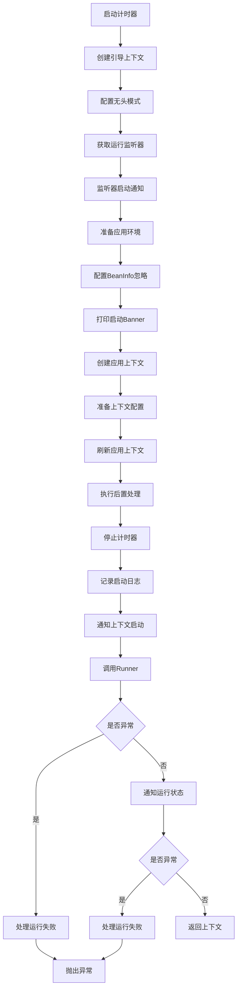

## Spring Boot 自动装配原理，源码剖析
1. springboot项目启动时，执行SpringApplication.run()方法
```java
@SpringBootApplication
public class HmDianPingApplication {
    public static void main(String[] args) {
        SpringApplication.run(HmDianPingApplication.class, args);
    }
}
```
2. 在SpringApplication类的run()的方法中，最终会重载调用public ConfigurableApplicationContext run(String... args)方法，这个方法内会调用一个refreshContext(context)方法来完成自动装配操作  
```java
public ConfigurableApplicationContext run(String... args) {
    StopWatch stopWatch = new StopWatch();
    stopWatch.start();
    DefaultBootstrapContext bootstrapContext = createBootstrapContext();
    ConfigurableApplicationContext context = null;
    configureHeadlessProperty();
    SpringApplicationRunListeners listeners = getRunListeners(args);
    listeners.starting(bootstrapContext, this.mainApplicationClass);
    try {
        ApplicationArguments applicationArguments = new DefaultApplicationArguments(args);
        ConfigurableEnvironment environment = prepareEnvironment(listeners, bootstrapContext, applicationArguments);
        configureIgnoreBeanInfo(environment);
        Banner printedBanner = printBanner(environment);
        context = createApplicationContext();
        context.setApplicationStartup(this.applicationStartup);
        prepareContext(bootstrapContext, context, environment, listeners, applicationArguments, printedBanner);
        refreshContext(context);
        afterRefresh(context, applicationArguments);
        stopWatch.stop();
        if (this.logStartupInfo) {
            new StartupInfoLogger(this.mainApplicationClass).logStarted(getApplicationLog(), stopWatch);
        }
        listeners.started(context);
        callRunners(context, applicationArguments);
    }
    catch (Throwable ex) {
        handleRunFailure(context, ex, listeners);
        throw new IllegalStateException(ex);
    }

    try {
        listeners.running(context);
    }
    catch (Throwable ex) {
        handleRunFailure(context, ex, null);
        throw new IllegalStateException(ex);
    }
    return context;
}
```

