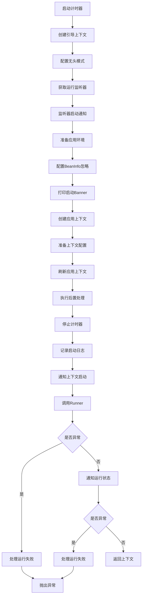

```mermaid
flowchart TD
    A[启动计时器] --> B[创建引导上下文]
    B --> C[配置无头模式]
    C --> D[获取运行监听器]
    D --> E[监听器启动通知]
    E --> F[准备应用环境]
    F --> G[配置BeanInfo忽略]
    G --> H[打印启动Banner]
    H --> I[创建应用上下文]
    I --> J[准备上下文配置]
    J --> K[刷新应用上下文]
    K --> L[执行后置处理]
    L --> M[停止计时器]
    M --> N[记录启动日志]
    N --> O[通知上下文启动]
    O --> P[调用Runner]
    P --> Q{是否异常}
    Q -->|是| R[处理运行失败]
    Q -->|否| S[通知运行状态]
    S --> T{是否异常}
    T -->|是| U[处理运行失败]
    T -->|否| V[返回上下文]
    R --> W[抛出异常]
    U --> W
```